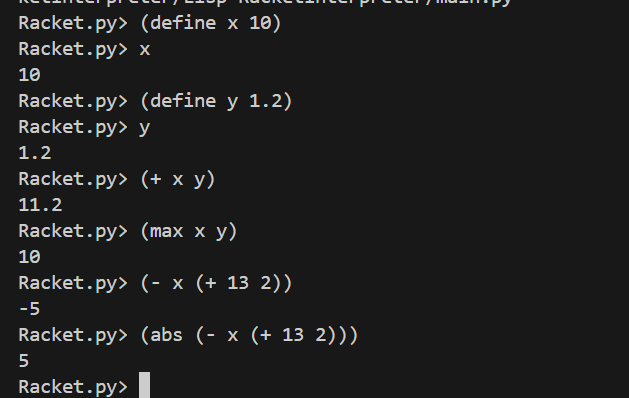

# Lisp-RacketInterpreter
Command Line Interpreter for the most beloved Racket (Lisp) language, and Gregor is the Goat 

The Components folder contain the environment, the evaluator, the parser and the type definitions.
The Tests folder contain tests for the program, and enabled by the `Pytest` library.
They can be ran simply by calling `pytest tests`.

Currently the program can only be ran through the `main.py` program. 

Development Python Version: 3.12.6
## How the program works
Program runs in REPL (read-eval-print loop). 
User input -> parse -> abstract syntax tree -> eval -> print result

Below is an image for reference:

## Components

### Type Definitions - `type_definitions.py`
Defines Scheme Objects 
- Symbol (defined as Python `str`)
- Number (defined as Python `int` or `float`)
- Atom (defined as Symbol or Number)
- List (defined as Python `list`)
- Exp (defined as `Atom` or `List`)
- Env (a scheme environment, which is a mapping of {variable: value})

### Environment - `environments.py`
Defines a global environment for eval. 
A mapping of variable names to their values and includes standard Racket functions such as `abs` and `max`.

### Parsing - `parse.py`
Parsing includes 2 main parts:
1. Lexer/Lexical Analysis, which converts input into a stream of tokens 
2. Syntactic Analysis, which checks the tokens against the grammatical structure of Racket and assembles them into an abstract syntax tree

### Evaluation - `evaluation.py`
During the evaluation step, the program traverses the AST, evaluating expressions and excutes the code in accordance to the environment.

## Future Improvements
### Features:
- increase language capabilities (ie. quotation, assignment, procedure/lambda), currently it's more of a calculator
- handle local variables, this means the environment must be redefined as a subclass of `dict`
- supercharge! Increase support for more racket functions to match the base library

## References:
- [lisp interpreter](https://norvig.com/lispy.html)
- [type definitions](https://stackoverflow.com/questions/43957034/specifying-a-type-to-be-a-list-of-numbers-ints-and-or-floats)

